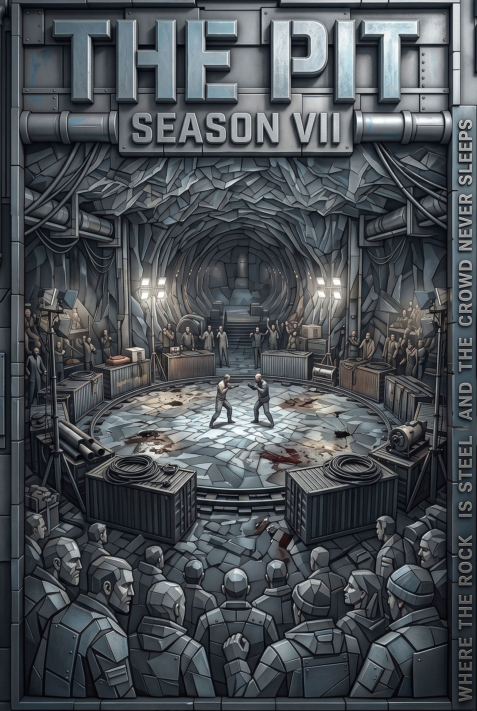

# THE PIT — Season VII · A word to the crowd. They found E-7. We move.

| THE_EDITOR | 4472 posts | 2251-07-15 | 08:00 |
|-|-|-|-|

Tags:
* THE PIT
* Europa Deep
* Season VII
* underground

## THE EDITOR'S WORD

**THE EDITOR · A word to the crowd**

Friends. You've seen the news. Yes, they found us. No, this is not the end.

THE PIT has run for seven seasons. Every time they find us — we leave. Every time we leave — we come back somewhere better. Sector E-7 was good. The next place will be better.

Three were detained. They knew what they were signing up for. They will receive compensation as agreed. We don't abandon our own — unlike those who are looking for us.

Season VII is not over. Three bouts remain, including the final. The schedule will be posted once we have settled. Watch for announcements. Bets on the final are open. Odds updated to reflect current circumstances.

ARE YOU NOT ENTERTAINED?

— THE EDITOR

---

## Fighters — Season VII Roster

| Callsign | Status | W / L / D | Style | Season VII |
| --- | --- | --- | --- | --- |
| THE DRILLER | Active | 23 / 4 / 1 | Wrestling. Endurance. Grinds opponents down. | Finalist — confirmed |
| IRON VEIN | Active | 17 / 8 / 0 | Striking. Aggressive openings. Fast finishes. | Finalist — confirmed |
| MAXIMUS-7 | Withdrawn | 31 / 2 / 3 | All-rounder. Veteran. Best record in PIT history. | Withdrawn — no explanation given |
| CAVE-IN | Active | 9 / 12 / 1 | Unorthodox technique. Unpredictable. | Eliminated in semifinal |
| PRESSUREMAN | Unknown | 14 / 6 / 2 | — | Did not appear for semifinal. Whereabouts unknown. |

---

## Bets — Season VII Final

| Fighter | Odds | Total staked | Bookmaker comment |
| --- | --- | --- | --- |
| THE DRILLER | 1.7 | 48,400 CR | Favourite. Won 6 of last 7. Style matches up well against IRON VEIN. |
| IRON VEIN | 2.1 | 31,200 CR | Underdog. Nobody gave him odds last season either. |
| Draw / no result | 12.0 | 3,100 CR | Rare but happens. Remember Season IV? |

---
---
## Comments

| gravel_mouth | 2251-07-15 | 09:14 |
|-|-|-|

MAXIMUS-7 withdrawn. No explanation. Do you understand what that means?

He was supposed to make the final. He has the best record in PIT history. Thirty-one bouts. And then — withdrawn.

I had him all season. But it's not about the money. What happened to him?

---

| deep_seven_regular | 2251-07-15 | 09:51 |
|-|-|-|

gravel_mouth — not the first time. Remember PRESSUREMAN? Just vanished too. 'Did not appear for semifinal.'

THE EDITOR never explains when a fighter disappears. Only when someone dies in the bout — and even then, two words.

I think MAXIMUS-7 left on his own. Or was asked to leave. Different things.

---

| anon_pit_watcher | 2251-07-15 | 10:22 |
|-|-|-|

Not from here. Found the forum through someone.

Question — is this real? I mean not staged?

Watched a recording from last season. Looks real. But it's hard to believe something like this just exists.

---

| THE_EDITOR | 2251-07-15 | 10:45 |
|-|-|-|

anon_pit_watcher.

Welcome to THE PIT.

Yes, it's real. No, it's not staged. People don't come here because they have nothing to do. They come because up there it's numbers, quotas, output targets, shifts. Down here — it's just a person against a person.

Nero gave the people bread and games. We have no bread. But the games are real.

The semifinal recording is in the archive. Audio is there too.

* [pit_semifinal_s7_audio.ogg](/pit_semifinal_s7_audio.ogg)

---

| gravel_mouth | 2251-07-15 | 11:30 |
|-|-|-|

THE EDITOR — about MAXIMUS-7.

I respect the rules. I'm not asking for personal details. But can you at least say — is he alive?

He's been here longer than anyone. Three seasons.

---

| THE_EDITOR | 2251-07-15 | 11:44 |
|-|-|-|

gravel_mouth.

Yes.

He left on his own feet.

---

| deep_seven_regular | 2251-07-15 | 12:01 |
|-|-|-|

Anyone else think they found us too fast?

We moved into E-7 three months ago. That's usually how long we run before moving. This feels off.

Someone talked. Or someone very much wanted us to move. Right now.

---

| THE_EDITOR | 2251-07-15 | 12:19 |
|-|-|-|

deep_seven_regular.

I've thought about it.

Don't know. Maybe you're right. Maybe coincidence.

The final will happen. Location — later.