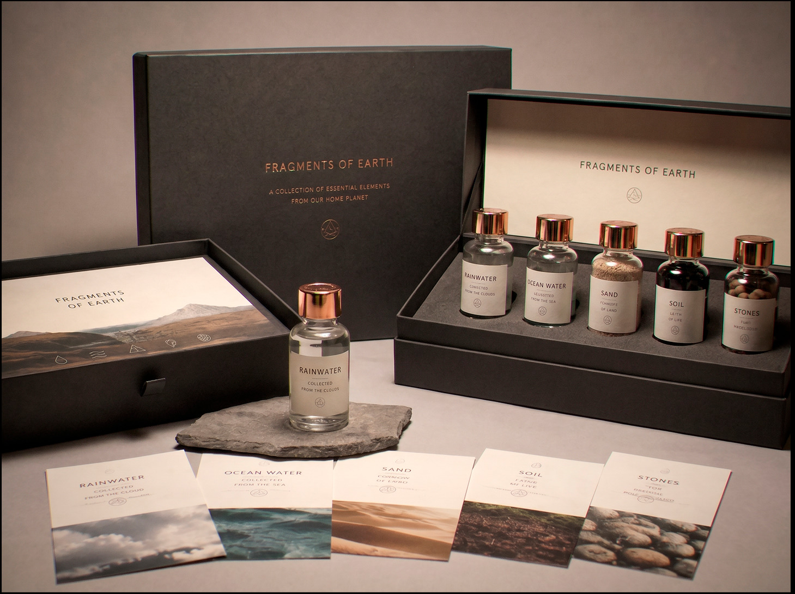

# 'A piece of home': the booming market for authentic Earth fragments

| Source | | Date | Author |
|-|-|-|-|
|  | SNN | 2251-07-25 | Vera Komarek · Culture & Society |

The listing reads: 'Authentic soil sample, northern coastal region, Earth. Collected prior to closure. Certificate of provenance available.' The asking price is 4,200 credits. The seller has completed 847 transactions with an average rating of 4.9 out of 5.

This is not an unusual listing. On any given day, the orbital marketplace hosts hundreds of similar offers — vials of sand described as coming from specific beaches, sealed ampoules of rainwater with hand-written labels, pressed leaves mounted in resin, small bags of dark soil. The claimed origins range from the generic ('Earth, pre-closure') to the specific ('sand from the Sahara, collected 2180, held in private collection').

The market, which has existed in smaller form for decades, has exploded in the past two years. Industry observers estimate the current volume of Earth fragment sales at several hundred thousand transactions annually, with average prices ranging from 200 credits for small soil samples to upwards of 50,000 credits for items with documented provenance chains.

'People want something real. Something that existed before all of this.' — seller active on the marketplace for eleven years, name withheld.

The central challenge for buyers is verification. Earth has been inaccessible for sixty years. No independent certification body exists for Earth-origin materials. Chemical analysis can confirm that a soil sample is consistent with Earth composition — but the same result would be returned by a sufficiently sophisticated synthetic replica, or by soil from certain terraformed sites.

'I know it might not be real. I bought it anyway. It sits on my desk and I look at it sometimes. That's enough for me.' — buyer, name withheld.

Sellers on the marketplace are subject to standard fraud provisions, but proving that a sample is not from Earth is as difficult as proving that it is. Investigations have been opened in several cases involving sellers with unusually high volumes and suspiciously uniform product descriptions. Most cases have not resulted in charges.

The market shows no signs of slowing. For a generation that has never seen Earth and may never see it, a small vial of sand — real or not — carries a weight that is difficult to measure in credits.