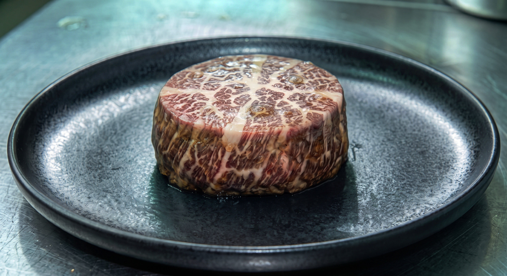

# Astrocrop's new synthetic meat variety is here. Consumers say it looks back.

| Source | | Date | Author |
|-|-|-|-|
|  | SNN | 2251-07-08 | SNN Staff · TECH & LIFE |

Astrocrop, the orbital food production company known for its line of synthetic protein products, has unveiled VELA-7 — a new generation of cultured meat that the company describes as 'the closest thing to real beef available beyond Earth.'

Early reviews confirm the taste claim. What consumers were less prepared for was the appearance.

VELA-7 is produced using Astrocrop's proprietary MYOCHAIN synthesis process, which the company says allows for more complex protein structures and, by extension, more realistic texture and marbling. The result, according to the product page, is 'a product indistinguishable from traditional animal protein in every meaningful way.'

The issue, as early buyers have noted across orbital consumer forums, is the texture of the surface. Multiple users report that VELA-7 exhibits what they describe as 'a very slight movement' when left unattended under certain lighting conditions. Others describe the marbling pattern as 'too symmetrical' or 'like it's arranged.'

'I don't want to be dramatic. It's probably the MYOCHAIN thing doing something with the protein fibers. But I put it on the counter and went to get a knife and when I came back it was facing a different direction. A different direction. It's a piece of meat.' — user review, orbital consumer platform.

Astrocrop addressed the feedback in a statement released this week. 'VELA-7 is produced under full regulatory compliance. The MYOCHAIN process does result in a higher degree of cellular organization than previous generations of synthetic protein, which may produce visual effects in certain lighting conditions. This does not affect the product's safety or nutritional profile.'

The company added that 'any perception of movement is the result of the protein fiber tension releasing post-synthesis, which is a normal part of the product lifecycle.'

'Protein fiber tension releasing. Right. That's what it is.' — response to Astrocrop's statement, orbital consumer forum, 4,200 upvotes.

VELA-7 is available now across all USOL and SOYUZ distribution networks. Astrocrop reports pre-orders exceeded projections by 340%. Taste remains, by all accounts, excellent.

Tags: Astrocrop · synthetic food · VELA-7 · orbital life · MYOCHAIN