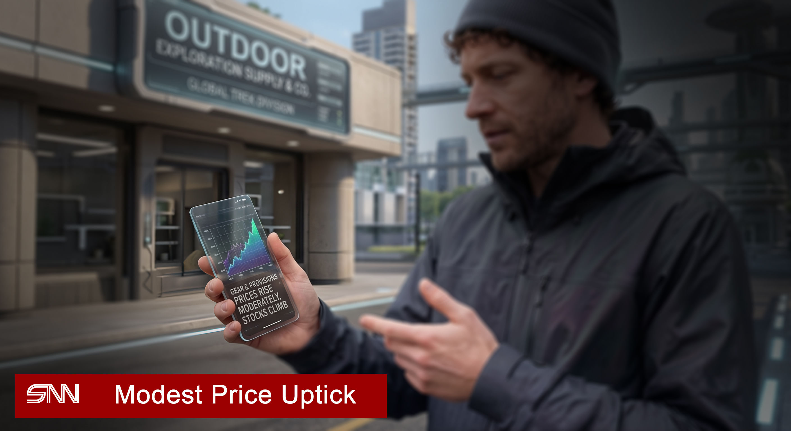

# Modest Price Uptick Across Mars Sectors

| | | |
|-|-|-|
|  | SNN | 2251-05-15 |

Prices for protective equipment, expedition gear, and long-term storage provisions have seen a moderate rise in recent cycles, reflecting steady rather than surging demand. While procurement has increased, market sources describe the trend as measured, with no immediate signs of supply chain stress.

Manufacturers Spiritus, Blackrock, and Unigroup posted modest stock gains in response — up 4%, 3.5%, and 3% respectively. Smaller firms have seen similar incremental movement.

Analysts remain divided on whether this signals a temporary seasonal adjustment or the early stages of a longer-term shift. "The numbers are notable but not alarming," commented one SNN trade observer. "We're watching to see if this levels off or builds."

Procurers are advised to monitor pricing but need not take urgent action at this stage.