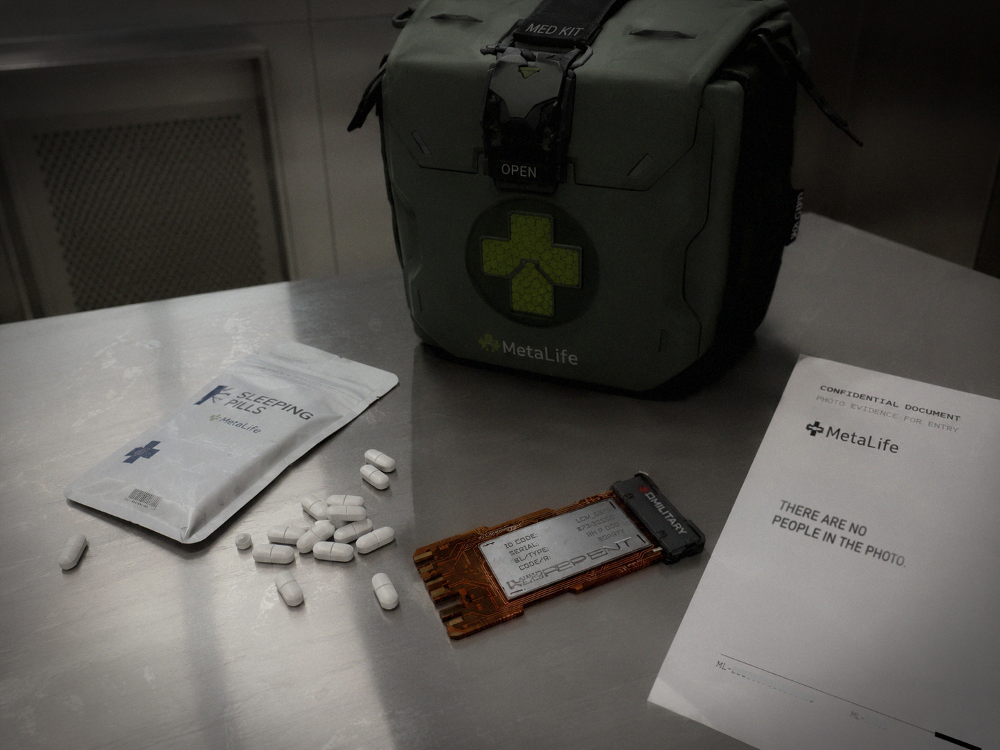

# RepEnt operators stop sleeping after using Mars simulators

| Source | | Date | Author |
|-|-|-|-|
|  | Last Transmission | 2251-07-30 | Jacklene Frost |

Medical researchers call for further study as neurological side effects emerge.

A growing number of RepEnt operators participating in long-duration Martian simulation programs are reporting severe disturbances to their sleep following completion of training exercises, according to internal medical summaries.

The simulations, designed to prepare operators for extended remote control of biological RepEnt platforms under Martian conditions, require participants to remain neurally linked to their assigned entities for prolonged periods. While the program has been praised widely for significantly improving operator performance, recent studies suggest the psychological cost may be higher than previously anticipated.

A new wave of studies was undertaken after two operators had died due to lack of sleep, shifting a new focus specifically related to sleep tests and assessments. Several operators described persistent insomnia lasting days and sometimes up to a week at a time after disconnecting from the simulation systems. Others reported vivid dreams where they continued to experience the sensory input of the RepEnt bodies after sessions had ended. What is remarkable is this experience and negative reaction, at this extreme degree, appears to be unique to Martian simulations.

"Sometimes I reach for objects and misjudge where my own hands are" one participant wrote in an incident questionnaire. Further research is required to pull apart hallucinations from lack of sleep to other possible side-effects.

Medical professionals involved with the program have stopped short of describing the condition as some form of neurological damage. Instead it is being called Persistent Remote Presence Adaptation Syndrome (PRPAS) and not being exclusively linked to the Mars case examples. The condition is being described as a temporary difficulty readjusting to one's biological body after RepEnt simulations. More concerning reports from clinical psychologists that a small number of operators have been describing symptoms unique to only the Martian simulator cases. More information is required.

The Core has issued a statement saying there are "no signs of permanent cognitive impairment", however all is being done to mitigate risks and keep operators safe. The majority of operators recover fully after therapy and observation. Nevertheless, several independent researchers have called for expanded long-term studies before increasing the duration of RepEnt simulator programs. With the technology expected to play an increasingly important role in hazardous exploration and operations, understanding the psychological effects of the technology may be just as important as learning to use the technology itself.