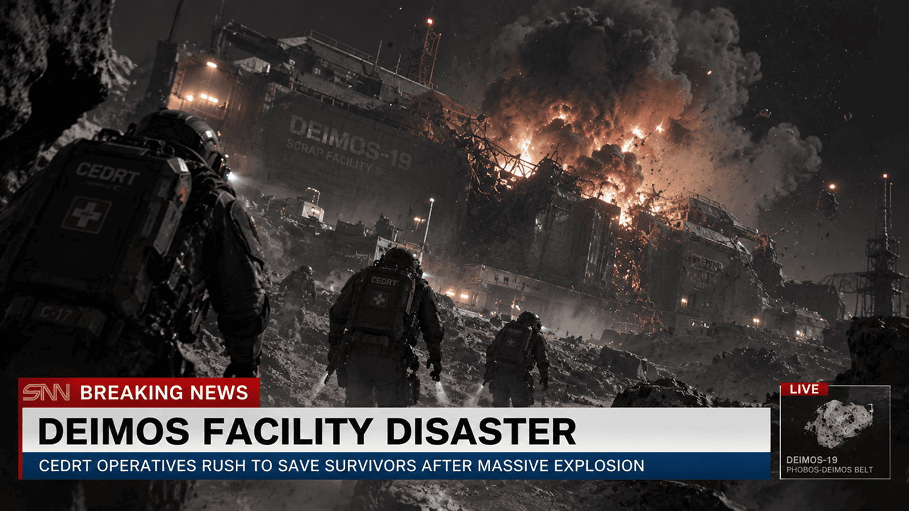

# SNN news - Deimos facility disaster

| Source | | Date | Author |
|-|-|-|-|
|  | SNN | 2251-11-15 |  |

A large explosion has just happened on the territory of the Deimos scrap facility 19!

Presumably, a high ranking official delegation has been reviewing the facility's estimates when the ammunition has exploded. The witnesses claim there could be no survivors. The unofficial version is an accidental weapon discharge that led to a chain reaction somehow.

Official statements are yet to come but many view and connect this with a “special treatment” that the review board has been giving all facilities around Mars.