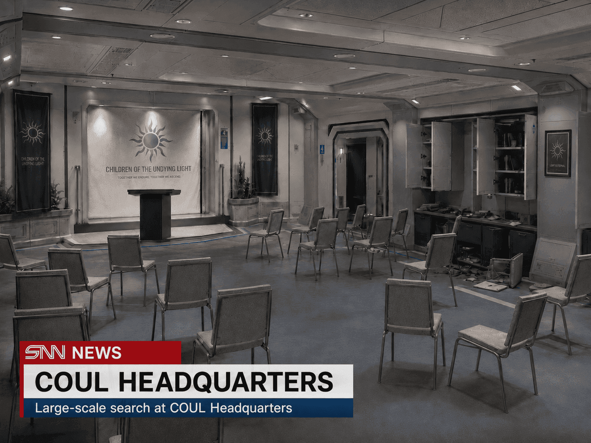

# Seven detained in raid linked to Children of the Undying Light

| Source | | Date | Author |
|-|-|-|-|
|  | SNN | 2251-07-04 | SNN Security Desk · SECURITY & CRIME |

Orbital security services have detained seven members of the religious movement Children of the Undying Light following an investigation into what authorities describe as preparations for a coordinated act of sabotage.

Security services confirmed that several locations associated with the movement were searched during the operation. Electronic equipment, encrypted storage devices and internal records were seized.

Authorities have not disclosed the intended target of the alleged sabotage or provided details on how advanced the preparations were.

The Children of the Undying Light have operated across several orbital stations for approximately twelve years. The movement is known for its opposition to parts of the return programme and, in particular, technologies involving remotely operated human-form units.

Auren Doss, founder and spiritual leader of the movement, was not among those detained.

His current location is unknown.

Security services declined to confirm whether Doss is considered directly involved in the alleged plot.

COUL maintains a public website at coul.light.corie. The site remains online and received updates shortly before the arrests, including changes to its public doctrine section.

Authorities declined to comment on why the site remains accessible.

'The investigation is active. Further operational details will not be released at this time.' — orbital security services

Tags: COUL · orbital security · Auren Doss · sabotage investigation · return programme