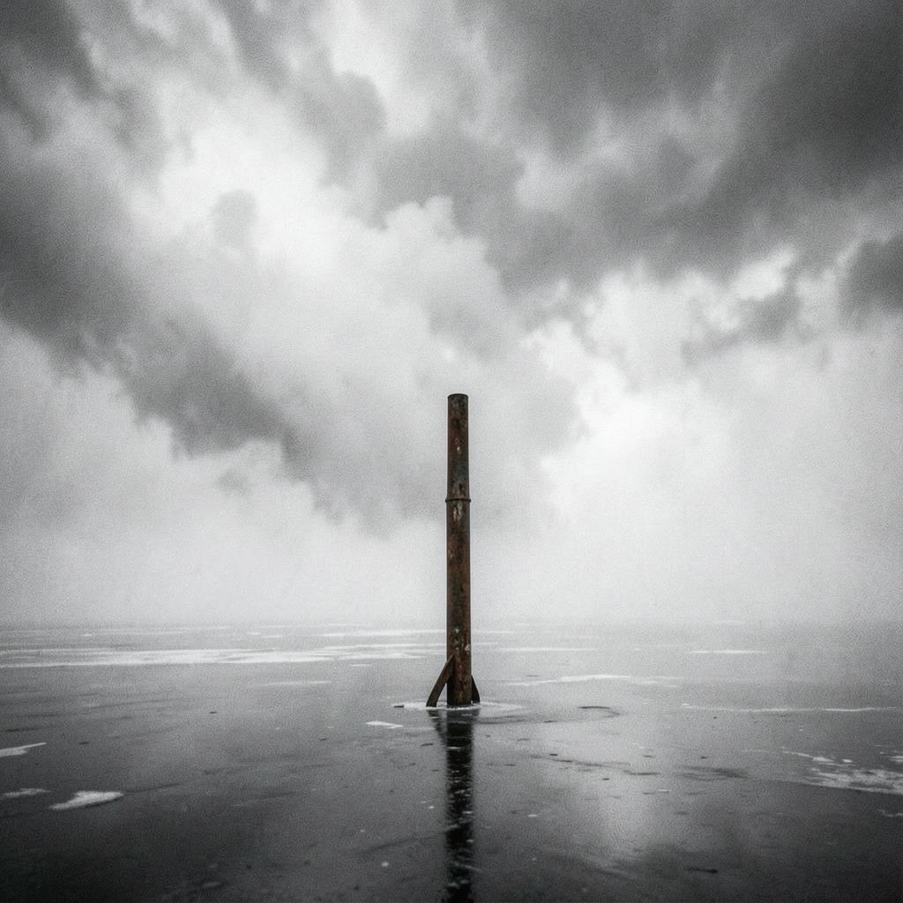

This song was [generated on suno.com](https://suno.com/song/2ca64983-9005-4ebe-b4da-a873614fe54d) by the account [StaccatissimoDynamo868](https://suno.com/@staccatissimodynamo868) on August 20, 2026 at 10:36 AM with the version `V5.5` and is titled as "Test".

The summary describes the song as `ambient, industrial, cinematic`, while the full styles is

> Atmospheric instrumental soundscape based on Huygens probe recordings from Titan. Processed wind and methane storm ambience are the lead elements. Music is secondary: only sparse bass pulses, distant distorted guitar swells, minimal tribal-industrial percussion, deep drones, radio interference, metallic creaks, and unstable synth textures.
> 
> Structure: 30 seconds of cold wind and static, then a slow bass pulse appears, then storm noise grows, then drums enter briefly, then everything drops into silence and low pressure hum, then a second heavier storm wave rises with distorted guitar feedback and industrial hits, then fades into lonely Titan wind.
> 
> Alien, cold, raw, unstable, evolving, cinematic but not orchestral. No vocals, no lyrics, no normal rock riffs, no constant beat, no pop structure, no EDM.

```
Atmospheric instrumental soundscape based on Huygens probe recordings from Titan, Processed wind and methane storm ambience are the lead elements, Music is secondary: only sparse bass pulses, distant distorted guitar swells, minimal tribal-industrial percussion, deep drones, radio interference, metallic creaks, and unstable synth textures, Structure: 30 seconds of cold wind and static, then a slow bass pulse appears, then storm noise grows, then drums enter briefly, then everything drops into silence and low pressure hum, then a second heavier storm wave rises with distorted guitar feedback and industrial hits, then fades into lonely Titan wind, Alien, cold, raw, unstable, evolving, cinematic but not orchestral, No vocals, no lyrics, no normal rock riffs, no constant beat, no pop structure, no EDM, ‑No vocals, ‑no lyrics, ‑no pop melody, ‑no EDM drop, ‑no orchestral trailer music, ‑no fantasy, ‑no clean corporate sci-fi, ‑no cheerful mood, ‑no polished radio rock
```

The cover art on SUNO is 
